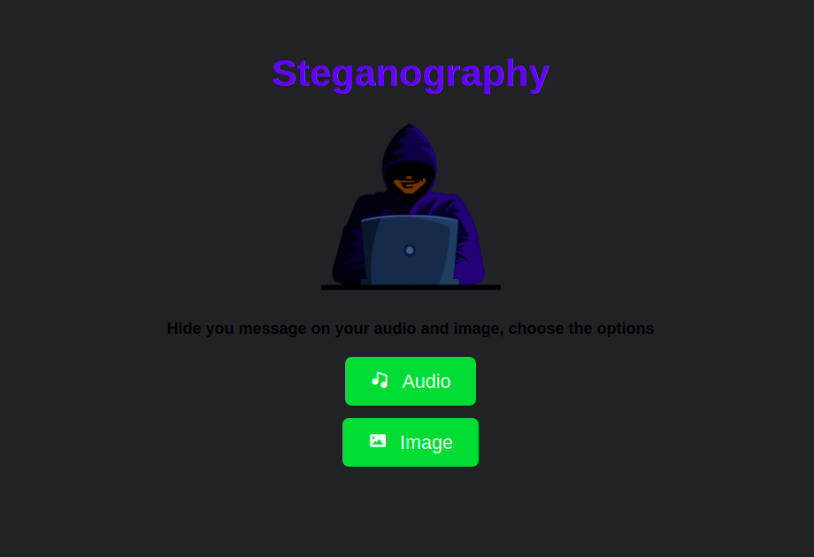
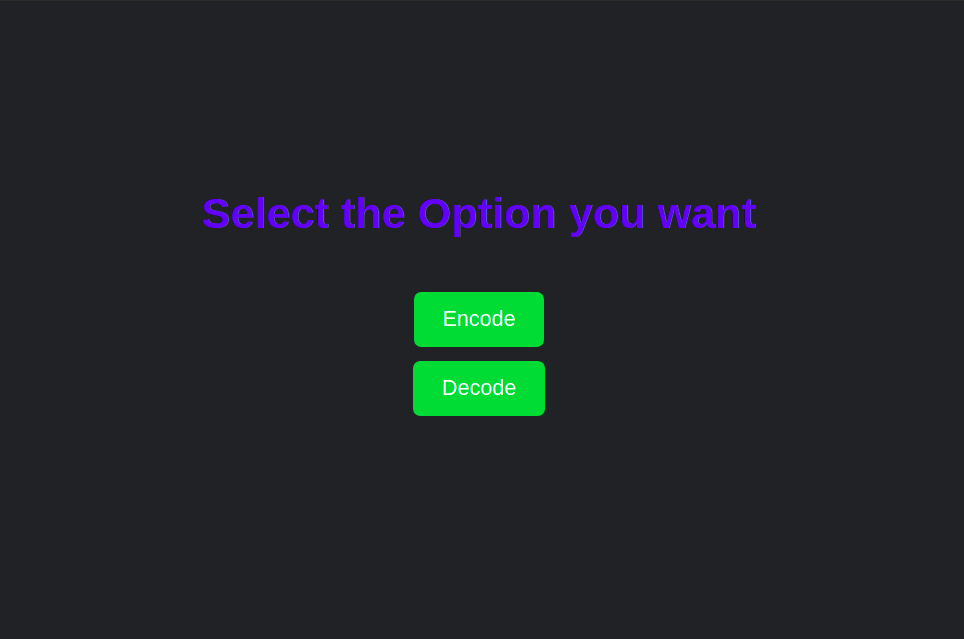
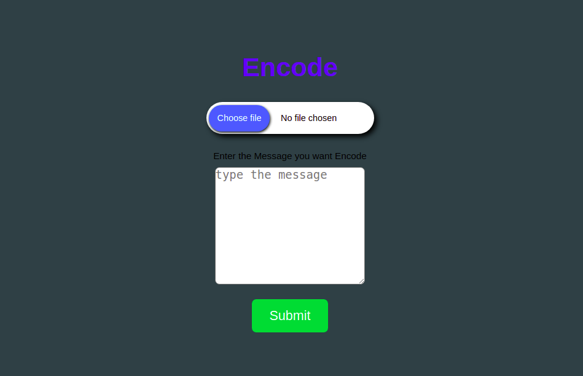
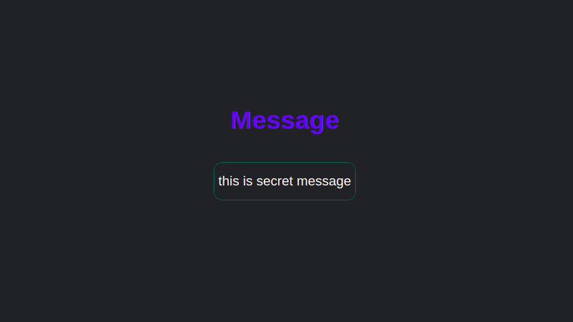

# steganograph_using_flask

## Introduction
#####      In this project, i build a stegnography website, that can use to hide a message in image and audio, this project is my favourite because i reseach a lot and learn lot

![stegnography][thumbnail]

## Screenshot

[thumbnail]: https://github.com/MdNaina/steganograph_using_flask/blob/main/screenshots/thumbnail.png "thumbnail"
